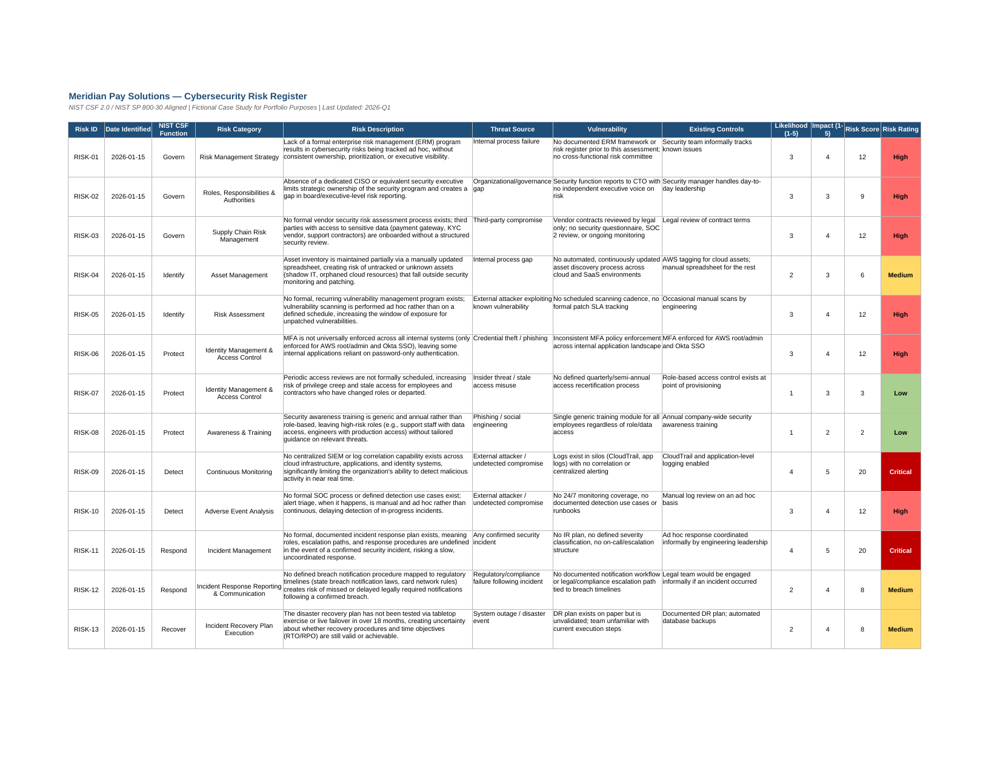
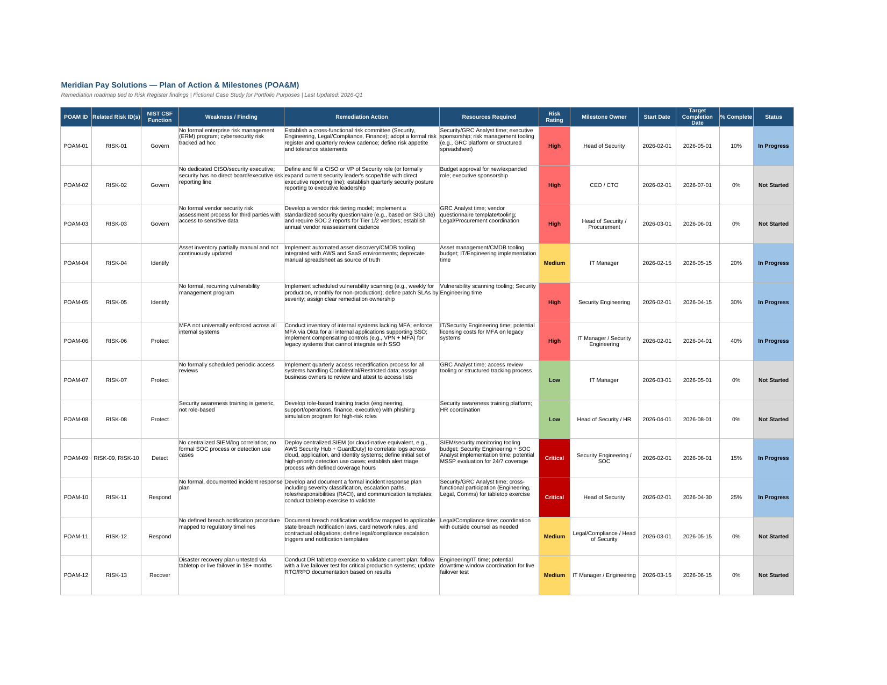

# Cybersecurity Governance, Risk & Compliance (GRC) Assessment
### Fictional Case Study: Meridian Pay Solutions

## Overview

This project is a comprehensive GRC assessment conducted for **Meridian Pay
Solutions**, a fictional mid-size fintech company (~250 employees) providing
payment processing and digital wallet services to small-to-mid-size merchants.

The assessment was performed using the **NIST Cybersecurity Framework (CSF) 2.0**
as the primary governance framework, with risk assessment methodology informed
by **NIST SP 800-30**. The goal is to evaluate the organization's current
cybersecurity posture, identify gaps against the framework, translate those
gaps into a prioritized risk register, and produce an actionable remediation
plan (POA&M).

> **Note:** Meridian Pay Solutions is a fictional company created for portfolio
> demonstration purposes. All data, findings, and artifacts in this repository
> are illustrative and do not represent a real organization.

## Why This Project

This project demonstrates practical GRC analyst skills, including:
- Applying the NIST CSF 2.0 framework to assess organizational security posture
- Conducting asset inventory and classification
- Performing a gap assessment against a recognized framework
- Translating qualitative findings into a quantitative, prioritized risk register
- Developing a Plan of Action & Milestones (POA&M) for remediation tracking
- Communicating findings to both technical and executive audiences

## Repository Structure

```
cybersecurity-governance-risk-assessment/
├── README.md                              # This file
├── docs/
│   ├── 01-executive-summary.md            # High-level findings & recommendations
│   ├── 02-asset-inventory.md              # Systems, data, and applications in scope
│   ├── 03-nist-csf-gap-assessment.md      # Current vs. desired state, all 6 CSF Functions
│   └── 04-methodology.md                  # Assessment approach, scope, and references
├── data/
│   ├── risk-register.xlsx                 # Prioritized risk register with scoring
│   └── poam.xlsx                          # Plan of Action & Milestones
├── templates/
│   └── risk-register-template.xlsx        # Reusable blank risk register template
└── screenshots/
    ├── risk-register-overview.png
    └── poam-overview.png
```

## Preview

**Risk Register** (Excel, with conditional formatting and scoring formulas):



**POA&M** (Excel, with status tracking and risk-rating color coding):



## How to Navigate This Project

1. Start with the **[Executive Summary](docs/01-executive-summary.md)** for a
   high-level overview of scope, methodology, and key findings.
2. Review the **[Asset Inventory](docs/02-asset-inventory.md)** to understand
   what systems and data were in scope for the assessment.
3. Read the **[NIST CSF Gap Assessment](docs/03-nist-csf-gap-assessment.md)**
   for the detailed current-state vs. desired-state analysis across all six
   CSF Functions (Govern, Identify, Protect, Detect, Respond, Recover).
4. Open the **[Risk Register](data/risk-register.xlsx)** to see how gaps were
   translated into scored, prioritized risks.
5. Open the **[POA&M](data/poam.xlsx)** to see the remediation roadmap tied to
   each risk, with owners, target dates, and status tracking.

## Framework & Standards Referenced

- [NIST Cybersecurity Framework (CSF) 2.0](https://www.nist.gov/cyberframework)
- [NIST SP 800-30 Rev. 1 — Guide for Conducting Risk Assessments](https://csrc.nist.gov/pubs/sp/800/30/r1/final)
- PCI-DSS (referenced where relevant to payment card data handling)
- GLBA Safeguards Rule (referenced where relevant to financial data protection)

## Tools & Skills Demonstrated

`NIST CSF 2.0` `Risk Assessment` `Risk Register Development` `POA&M / Remediation Planning`
`Gap Analysis` `GRC Documentation` `Microsoft Excel` `Security Policy Review`

## About This Project

This is a self-directed portfolio project built to demonstrate GRC analyst
capabilities for job applications. Feedback and suggestions are welcome via
GitHub Issues.

**Author:** [Your Name] | [LinkedIn] | [Portfolio/Website]
