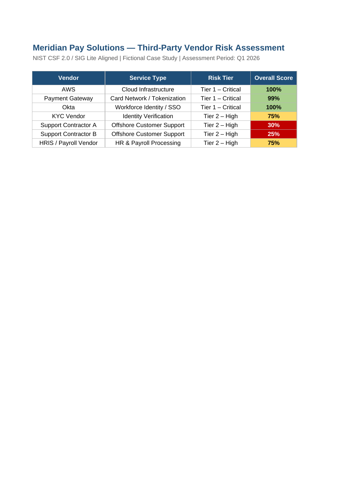

# Third-Party Vendor Risk Assessment

**Organization:** Meridian Pay Solutions
**Assessment Type:** Third-Party / Supply Chain Vendor Risk Assessment
**Framework Reference:** NIST CSF 2.0 (GV.SC) | SIG Lite-aligned questionnaire
**Assessment Period:** Q1 2026
**Classification:** Internal — Confidential

---

## Purpose

This assessment was conducted to address **RISK-03** and **POAM-03** from the
[Risk Register](../data/risk-register.xlsx), which identified the absence of a
formal vendor security risk management program as a High-severity gap.
Meridian Pay Solutions relies on seven third-party vendors with varying degrees
of access to sensitive payment, customer, and employee data. This assessment
evaluates each vendor's security posture using a standardized questionnaire
covering eight security domains.

## Vendors Assessed

| Vendor | Service | Risk Tier |
|---|---|---|
| AWS | Cloud Infrastructure | Tier 1 – Critical |
| Payment Gateway | Card Network / Tokenization | Tier 1 – Critical |
| Okta | Workforce Identity / SSO | Tier 1 – Critical |
| KYC Vendor | Identity Verification | Tier 2 – High |
| Support Contractor A | Offshore Customer Support | Tier 2 – High |
| Support Contractor B | Offshore Customer Support | Tier 2 – High |
| HRIS / Payroll Vendor | HR & Payroll Processing | Tier 2 – High |

## Assessment Methodology

Each vendor was evaluated across eight security domains using a 71-question
questionnaire aligned to the SIG Lite (Standardized Information Gathering)
framework. Questions were scored Yes (1.0) / Partial (0.5) / No (0.0) / N/A
(excluded from average). Domain scores were averaged to produce an overall
vendor score, mapped to a risk rating:

| Score | Rating |
|---|---|
| ≥ 85% | Low Risk |
| 65–84% | Medium Risk |
| 45–64% | High Risk |
| < 45% | Critical Risk |

## Results Summary

| Vendor | Overall Score | Risk Rating |
|---|---|---|
| AWS | 100% | Low Risk |
| Payment Gateway | 99% | Low Risk |
| Okta | 100% | Low Risk |
| KYC Vendor | 75% | Medium Risk |
| Support Contractor A | 30% | **Critical Risk** |
| Support Contractor B | 25% | **Critical Risk** |
| HRIS / Payroll Vendor | 75% | Medium Risk |

Full scored questionnaires for all seven vendors are in
[vendor-risk-assessment.xlsx](../data/vendor-risk-assessment.xlsx).

## Key Findings

**Tier 1 vendors (AWS, Okta, Payment Gateway) present low risk.** All three
hold current SOC 2 Type II reports, enforce MFA universally, operate 24/7 SOC
functions, and conduct annual third-party penetration testing. Their security
programs are mature and well-documented.

**The two offshore support contractors (Critical Risk) represent the most
urgent vendor risk.** Despite having direct access to customer transaction and
merchant data, both contractors lack formal incident response plans, security
leadership, SOC 2 certification, centralized security monitoring, and
documented subcontractor controls. Given their data access, this exposure is
material and requires immediate remediation or contract review.

**KYC Vendor and HRIS/Payroll Vendor present Medium Risk** with generally
adequate controls but notable gaps in: periodic access reviews, data inventory
documentation, centralized SIEM/monitoring, and subcontractor risk management.
These gaps should be addressed in the next vendor contract renewal cycle.

## Recommendations

Require both offshore support contractors to submit a formal remediation plan
within 30 days addressing their Critical-rated gaps, or renegotiate data
access scope to reduce exposure while remediation is in progress. For KYC and
HRIS vendors, incorporate security questionnaire responses and SOC 2 report
review into the next contract renewal. Formalize an annual vendor reassessment
cadence for all Tier 1 and Tier 2 vendors, tracked within the GRC program.

---

*Back to: [README](../README.md) | Related: [Risk Register — RISK-03](../data/risk-register.xlsx)*
